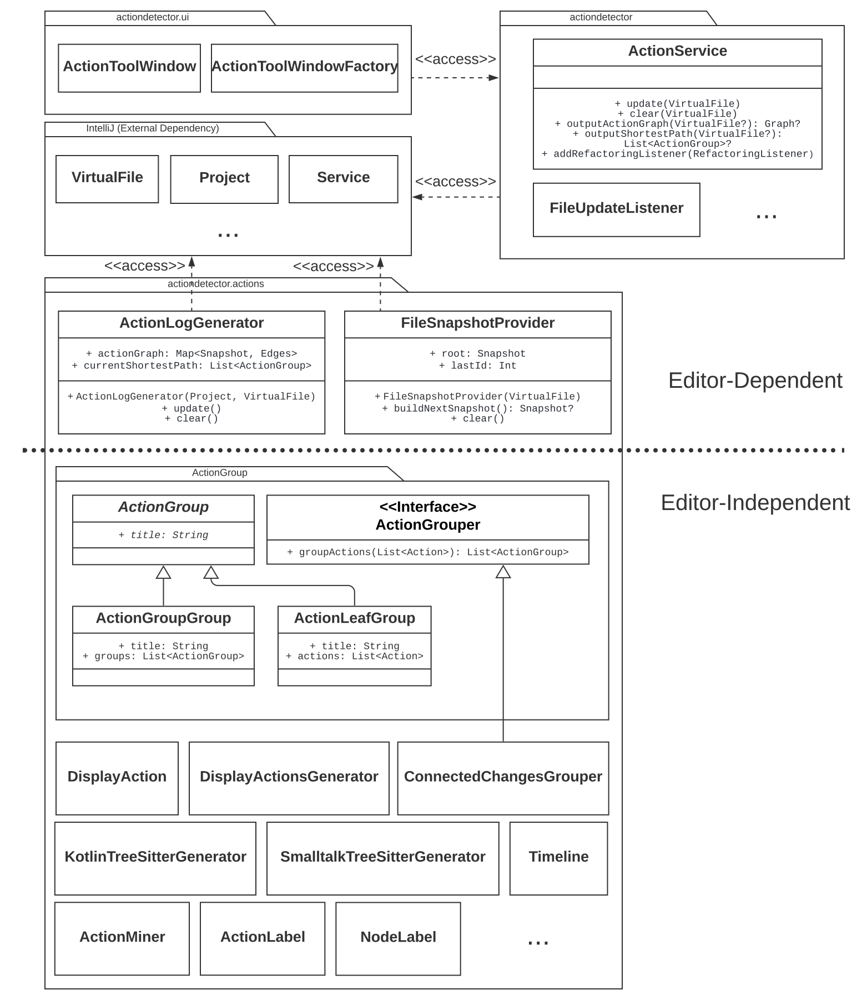

# intellij-action-detection

<!-- Plugin description -->
Detect Actions and group them
<!-- Plugin description end -->

## Setup
1. Clone this repo
2. Clone [Gumtree](https://github.com/GumTreeDiff/gumtree), checkout `194393c98caa0a360c3f604786b6c552b714ef9c` and run the tasks `:core:publishToMavenLocal`, `:client:publishToMavenLocal` and `:gen.treesitter:publishToMavenLocal`
3. Clone [this fork of Tree-Sitter-Parser](https://github.com/Paulpanther/tree-sitter-parser) with the `--recurse-submodules` flag (or run `git submodule update --init`) and run `pip3 install tree_sitter`
4. Create two environment variables. `TREE_SITTER` with the full path to the `tree-sitter-parser.py` (including the file) and `TREE_GENERATOR` which can be either `java`, `kotlin` or `smalltalk`
5. Run `./gradlew runIde`

## How to use
1. Open or create a project. 
2. Open a file (filetype has to match `TREE_GENERATOR` variable)
3. Do some changes (They should appear on the side under "Detected Actions". If nothing happens close the file and open it again)

## Dependency on IntelliJ
Most of this project is editor-independent. The dependency on IntelliJ's `VirtualFile` in `ActionLogGenerator` and `FileSnapshotProvider` could be removed by providing a custom implementation for file handles.

